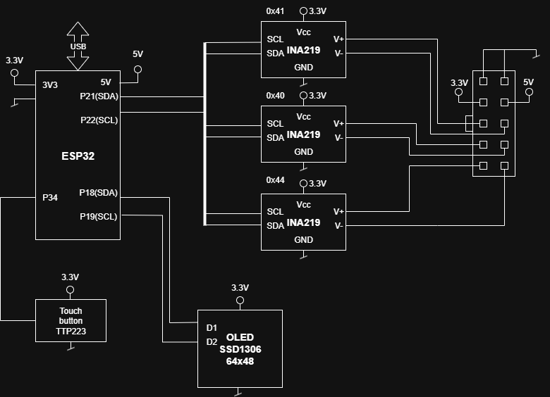
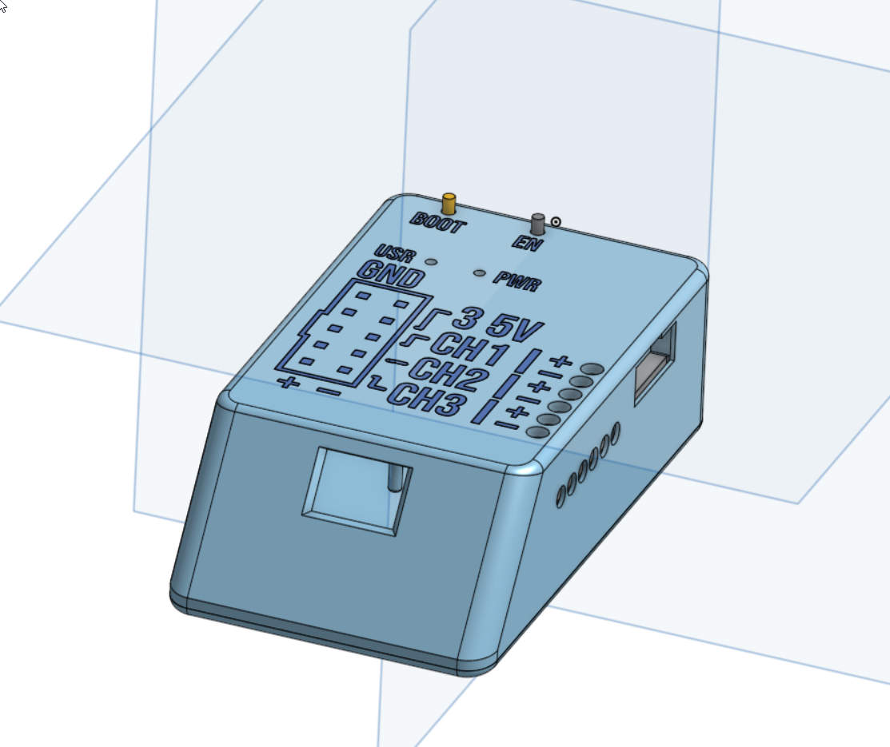
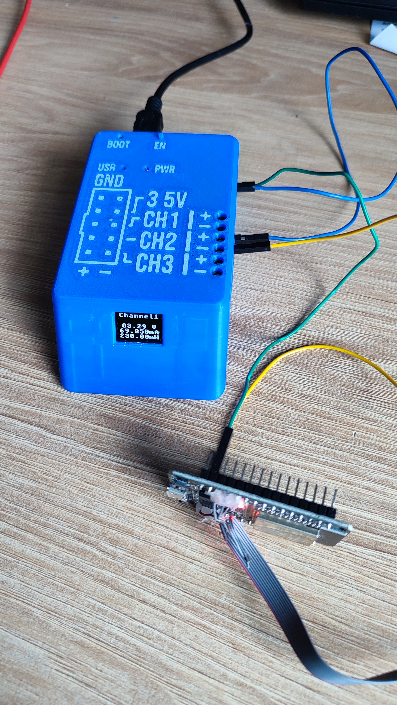
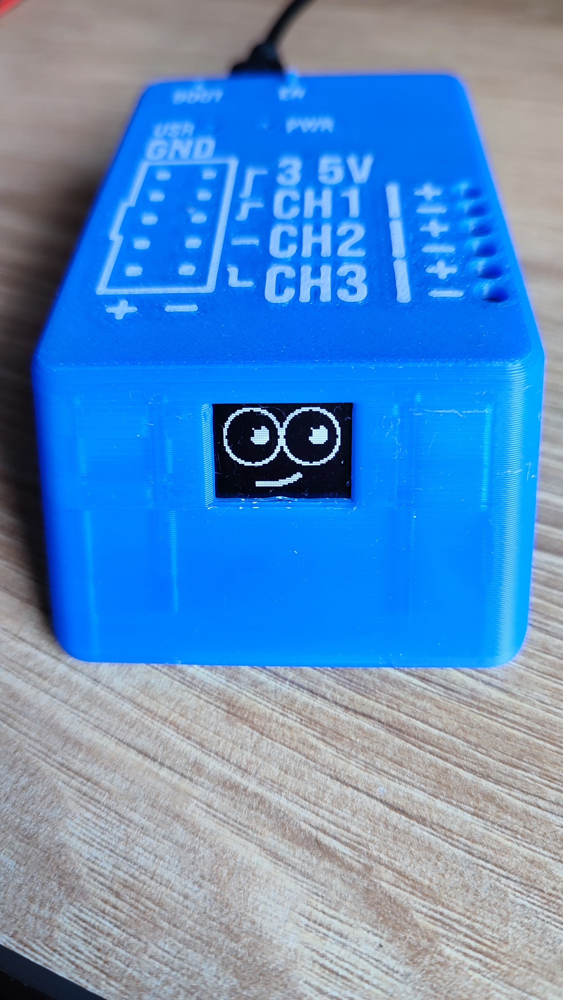
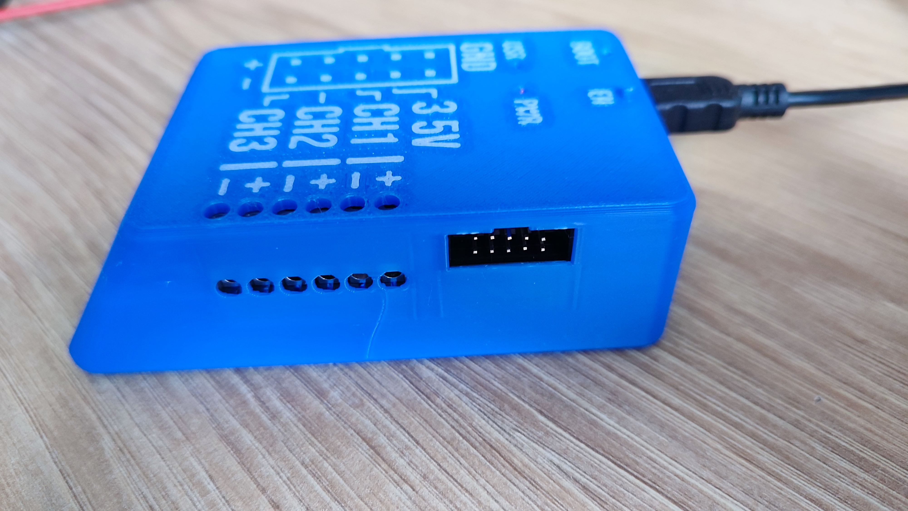
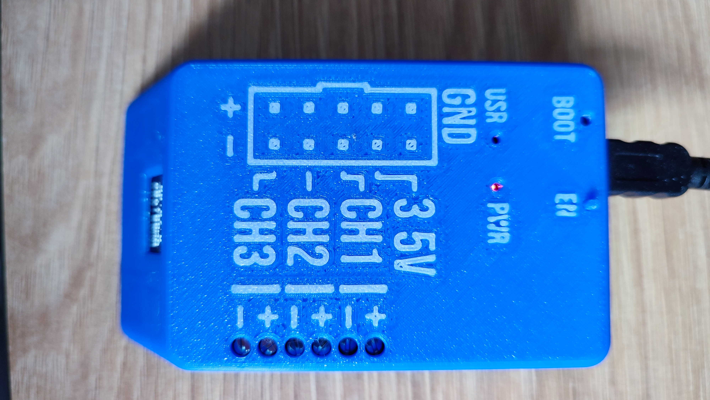
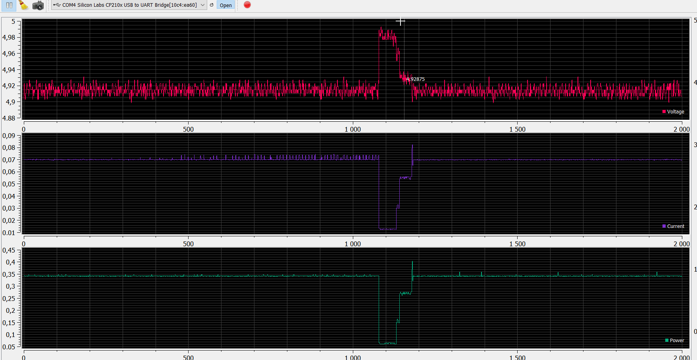

# DC Meter Project (INA219 + ESP32 + OLED + Button)

A complete open-source DC meter for low-power device development, based on ESP32, three INA219 sensors, SSD1306 OLED display, and a capacitive touch button (TTP233).  
Includes firmware, 3D printable enclosure, wiring diagrams, and ready-to-use SerialPlot configuration files.

---

## Features

- Measures voltage, current, and power on up to 3 channels using INA219 sensors.
- Configurable measurement channels (enable/disable voltage, current, power per channel).
- OLED display (SSD1306 64x48) for live readings and demo mode.
- Capacitive touch button (TTP233) for user interaction (mode/channel switching).
- UART communication for data output and command input.
- Supports both raw binary and ASCII print modes for measurement data.
- Periodic measurement with configurable timer period.
- FreeRTOS-based multitasking for measurement and communication.
- Easily configurable I2C pins and addresses via `menuconfig`.
- Optional auto-configuration of INA219 gain and voltage range.
- SerialPlot integration with ready-to-use `.ini` settings files.
- 3D printable enclosure (STL/3MF for Bambu Studio).

    This project supports up to max 1kHz sampling with only one channel enabled.
---

## Bill of Materials (BOM)

| Qty | Part                     | Description                | Link  |
|-----|--------------------------|----------------------------|------------------------------|
| 1   | ESP32 DEVKIT V1          | Main MCU board             | [ESP32 DEVKIT V1](https://pl.aliexpress.com/item/1005008127727230.html?spm=a2g0o.productlist.main.2.4fbd5b81pgBHzn&algo_pvid=c88f3f80-693c-4b7c-a2af-bbc7c63ec258&algo_exp_id=c88f3f80-693c-4b7c-a2af-bbc7c63ec258-1&pdp_ext_f=%7B%22order%22%3A%2238%22%2C%22eval%22%3A%221%22%7D&pdp_npi=4%40dis%21PLN%2122.65%2113.59%21%21%2143.35%2126.01%21%40211b81a317527376772814506eaa8a%2112000043901420260%21sea%21PL%21715926589%21X&curPageLogUid=SpOfImPENdXV&utparam-url=scene%3Asearch%7Cquery_from%3A)          |
| 3   | INA219 Module            | Current sensor             | [INA219 Module](https://pl.aliexpress.com/item/1005007533576335.html?spm=a2g0o.productlist.main.2.3a71277ePU7ICO&algo_pvid=e4750828-6368-40c8-b0e3-5eaaf1fcc03b&algo_exp_id=e4750828-6368-40c8-b0e3-5eaaf1fcc03b-1&pdp_ext_f=%7B%22order%22%3A%221107%22%2C%22eval%22%3A%221%22%7D&pdp_npi=4%40dis%21PLN%215.89%215.89%21%21%2111.27%2111.27%21%40211b618e17527376490881295ebe02%2112000041187110498%21sea%21PL%21715926589%21X&curPageLogUid=7Y2tgRzAIr8I&utparam-url=scene%3Asearch%7Cquery_from%3A)            |
| 1   | SSD1306 OLED 64x48       | Display (I2C)              | [SSD1306 OLED 64x48](https://pl.aliexpress.com/item/1005009104650988.html?spm=a2g0o.productlist.main.14.364b70ccK7vAJt&algo_pvid=7561c30e-addf-48a8-bd58-e218e409d835&algo_exp_id=7561c30e-addf-48a8-bd58-e218e409d835-13&pdp_ext_f=%7B%22order%22%3A%224%22%2C%22eval%22%3A%221%22%7D&pdp_npi=4%40dis%21PLN%2120.60%219.89%21%21%2139.43%2118.93%21%402103834817527375947432796eafd5%2112000047927651567%21sea%21PL%21715926589%21X&curPageLogUid=RUCYAkoLKWPg&utparam-url=scene%3Asearch%7Cquery_from%3A)       |
| 1   | TTP233 Capacitive Button | Touch button (digital out) | [TTP233](https://pl.aliexpress.com/item/1005007480801162.html?spm=a2g0o.productlist.main.2.60db7b0dT9bB1q&algo_pvid=bab3657f-b8aa-4d3d-a3e3-f439a6e89ffb&algo_exp_id=bab3657f-b8aa-4d3d-a3e3-f439a6e89ffb-1&pdp_ext_f=%7B%22order%22%3A%22497%22%2C%22eval%22%3A%221%22%7D&pdp_npi=4%40dis%21PLN%214.83%214.28%21%21%219.24%218.19%21%402103846917527374835031666ef36d%2112000040925382366%21sea%21PL%21715926589%21X&curPageLogUid=utwQNHSnM42H&utparam-url=scene%3Asearch%7Cquery_from%3A)                   |
| 1   | 3D Printed Enclosure     | STL/3MF files provided     | [3D Model](https://cad.onshape.com/documents/d86296f212e362e831ebef51/w/36947445886156c88ad6d59d/e/d64ef3975a24c979aa83f3d0?renderMode=0&uiState=6878a691e7ee6026786253c3)                 |
| n   | Wires, Connectors        | For assembly               |                              |
| n   | Pull-up resistors        | For I2C lines (if needed)  |                              |

---

## Wiring & Connections

### ESP32 Pinout

| Signal      | ESP32 Pin | Module/Part      |
|-------------|-----------|------------------|
| I2C SDA     | GPIO 18   | OLED    |
| I2C SCL     | GPIO 19   | OLED    |
| I2C SDA     | GPIO 22   | INA219s   |
| I2C SCL     | GPIO 21   | INA219s   |
| Button      | GPIO 34   | TTP233 OUT       |
| OLED VCC/GND| 3V3/GND   | ESP32            |
| INA219 VCC/GND | 3V3/GND | ESP32           |

**Note:**  
- Project uses separate I2C buses to povide conflicts on I2C when measurement period is very fast.
- Connect all INA219 to one I2C and OLEd to second one.
- Use pull-up resistors (typically 4.7kΩ) on SDA/SCL if not present on modules.
- TTP233 OUT connects to ESP32 GPIO 34 (digital input).

### Example Wiring Diagram



---

## Enclosure & 3D Models

- Enclosure designed for ESP32 DEVKIT V1, SSD1306 OLED (64x48), and TTP233 button.
- STL and 3MF files included for Bambu Studio and other slicers.

- [Download 3MF for Bambu Studio](case_model/DC_Meter_Case.3mf)
- [Model available on Onshape.com](https://cad.onshape.com/documents/d86296f212e362e831ebef51/w/36947445886156c88ad6d59d/e/d64ef3975a24c979aa83f3d0?renderMode=0&uiState=6878a691e7ee6026786253c3)

---

## SerialPlot Integration

- Ready-to-use SerialPlot `.ini` settings files included:
  - `serialplot/sett_ch9_vcp_default.ini` (raw mode)
  - `serialplot/sett_ch9_vcp_default_ascii.ini` (ASCII mode)
  - `serialplot/sett_ch1_vcp.ini` (single channel example)
- These files configure SerialPlot for live visualization of all channels.
- See [SerialPlot](https://serialplot.org/) for installation.

---

## Firmware Usage

1. **Configure the project** using `idf.py menuconfig`:
    - Set I2C pins, INA219 addresses, shunt resistor value, and LCD options if needed.
2. **Build and flash the firmware**:
    ```sh
    idf.py build
    idf.py flash monitor
    ```
3. **Connect SerialPlot** using the provided `.ini` files for live data plotting.
4. **Button Functions**:
    - Short press: Switch channel (in normal mode).
    - Long press: Switch display mode (demo/normal).

---

## UART Protocol Details

The device communicates over UART using a simple binary protocol for both commands and data.

### Data Output

- **Raw Binary Mode:**  
  Each message starts with two header bytes (`0xAA`, `0xBB`), followed by a length byte, and then the measurement data.  
  The data fields and their order depend on the enabled configuration for each channel (voltage, current, power).  
  - Header: `0xAA 0xBB`
  - Length: Number of data bytes following the header (excluding header and length byte)
  - Data: Floats (4 bytes each) for enabled measurements, in channel order (ch1, ch2, ch3)
- **ASCII Mode:**  
  Each measurement is printed as a comma-separated line of floats:  
  ```
  V1, I1, P1, V2, I2, P2, V3, I3, P3
  ```
  Only enabled measurements are printed.

### Command Input

Commands are sent as binary messages. The first byte is the command type, followed by command-specific data.

| Command Name         | Code (hex) | Payload Format                  | Description                                 |
|----------------------|------------|---------------------------------|---------------------------------------------|
| Start/Stop           | 0x0A       | `[0x0A, 0x01]` or `[0x0A, 0x00]` or `[0x0A, 0x02]` | Start (`0x01`), stop (`0x00`), or start without auto-config (`0x02`) |
| Set Timer Period     | 0x0B       | `[0x0B, <u8>, <u8>, <u8>, <u8>]`| Set period in microseconds (little-endian)  |
| Set Print Mode       | 0x0C       | `[0x0C, 0x00]` or `[0x0C, 0x01]`| Raw (`0x00`) or ASCII (`0x01`) output       |
| Channel Config       | 0x0D       | `[0x0D, <ch1>, <cfg1>, <ch2>, <cfg2>, <ch3>, <cfg3>]` | Set channel configuration. See below. |
| Status               | 0x0E       | `[0x0E]`                        | Query current status/config                 |
| Display Mode         | 0x0F       | `[0x0F, 0x00/0x01]`             | Set display mode (normal/demo)              |

**Channel Config Bytes:**  
Each channel config consists of two bytes:
- `<chX>`: Bit 0: Voltage enable, Bit 1: Current enable, Bit 2: Power enable
- `<cfgX>`: 
    - Bits 0-1: Gain (0=1, 1=0.5, 2=0.25, 3=0.125)
    - Bit 2: Bus voltage range (0=16V, 1=32V)
    - Bits 4-7: Bus voltage resolution (see `ina219.h` for values)

Example:  
To enable voltage and current for channel 1, only current for channel 2, and all for channel 3:  
`[0x0D, 0x03, 0x10, 0x02, 0x10, 0x07, 0x10]`  
- ch1: 0x03 = 0b011 (voltage+current), 0x10 = gain/resolution config
- ch2: 0x02 = 0b010 (current), 0x10 = gain/resolution config
- ch3: 0x07 = 0b111 (all enabled), 0x10 = gain/resolution config

---

## Images

- 
- 
- 
- 
- 

---

## File Structure

- `main.c` - Application entry point.
- `CurrentDrv.c/h` - INA219 driver and measurement logic.
- `CommM.c/h` - UART communication and command handling.
- `DisplayM.c/h` - OLED display and button logic.
- `serialplot/` - SerialPlot settings files (`.ini`).
- `models/` - 3D models and 3MF file for enclosure.
- `images/` - Photos, wiring diagrams, screenshots.
- `Kconfig.projbuild` - Project configuration options.
- `idf_component.yml` - Component dependencies.

---

## License

This project is licensed under the [MIT License](LICENSE).  
You are free to use, modify, and distribute this software for any purpose, including commercial use, as long as you include the original copyright.

---
